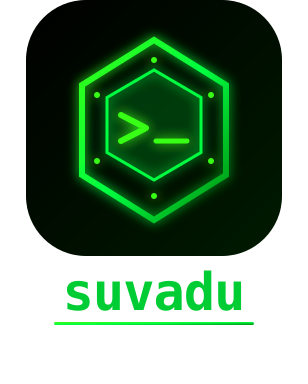

<p align="center">
  
</p>
<p align="center"><strong>Total recall for your terminal. Shared memory for your AI agents.</strong></p>
<p align="center">
  <a href="https://github.com/AppachiTech/suvadu/actions/workflows/ci.yml"></a>
  <a href="https://crates.io/crates/suvadu"></a>
  <a href="LICENSE"></a>
  <a href="https://github.com/AppachiTech/suvadu/releases"></a>
</p>

<p align="center">
  
</p>

**Suvadu** replaces your shell history with a SQLite-backed store. Every command gets structured context — exit code, duration, directory, executor, session. AI agents can query it via MCP. 100% local.

- **<2ms** recording overhead, **<10ms** search across 1M+ entries
- **AI agent tracking** — auto-detects Claude Code, Cursor, OpenCode, Antigravity, Windsurf, pi.dev, Codex, Aider
- **Prompt Explorer** — trace every command back to the prompt that triggered it
- **MCP Server** — 15 tools + 7 resources. Agent session discovery, project context, failure learning, risk assessment. Configurable via `suv settings`
- **100% local** — no cloud, no telemetry, no account. MIT licensed.

> **Website & Docs:** [suvadu.sh](https://suvadu.sh) &middot; **CLI Reference:** [suvadu.sh/cli](https://suvadu.sh/cli/) &middot; **Blog:** [suvadu.sh/blog](https://suvadu.sh/blog/) &middot; **What's new:** [CHANGELOG](CHANGELOG.md)

---

## Install

```bash
# Homebrew (macOS)
brew tap AppachiTech/suvadu && brew install suvadu

# Install script (macOS & Linux)
curl -fsSL https://downloads.appachi.tech/suvadu/install.sh | bash

# Cargo
cargo install suvadu
```

Then add shell hooks:

```bash
# Zsh
echo 'eval "$(suv init zsh)"' >> ~/.zshrc && source ~/.zshrc

# Bash
echo 'eval "$(suv init bash)"' >> ~/.bashrc && source ~/.bashrc
```

Verify: `suv status`

---

## Quick Start

```bash
suv search                  # Interactive search TUI (also Ctrl+R)
suv history                 # Print last 25 commands (pipeable)
suv history --json -n 100   # Last 100 commands as JSONL
suv stats                   # Stats dashboard with heatmap
suv replay --after today    # Timeline of today's commands
suv doctor                  # Check installation health
suv agent dashboard         # Monitor AI agent activity
suv agent prompts           # Browse prompts and their commands
```

---

## AI Agent Setup

```bash
suv init claude-code    # Claude Code — hooks + MCP + prompt capture
suv init cursor         # Cursor — hooks + MCP + prompt capture
suv init opencode       # OpenCode — plugin + prompt capture
suv init pi             # pi.dev — extension + prompt capture
suv init antigravity    # Antigravity — auto-detect
```

Then ask your agent: *"What commands failed in this project recently?"*

See the [full integration guide](https://suvadu.sh/blog/track-ai-agent-commands-with-suvadu/) and [MCP server docs](https://suvadu.sh/cli/mcp-server/).

---

## Key Features

| Feature | Details |
|---------|---------|
| **Search** | Substring search TUI (your own commands by default; `Ctrl+A` shows agents, `Ctrl+E` shows failures only) with filters, Smart mode, detail pane, bookmarks |
| **History** | Non-interactive `suv history` with filters, `--json`, pipeable to other tools |
| **Agent Dashboard** | Timeline, risk assessment, per-agent analytics, exportable reports; `suv agent report --fail-on <low\|medium\|high\|critical>` for local CI / git-hook gating |
| **MCP Server** | 15 tools + 7 resources — agent session replay, project context, failure learning, configurable |
| **Prompt Explorer** | Trace commands back to the prompt that triggered them |
| **Stats** | Heatmap, hourly distribution, top commands, executor breakdown; `--human` (or `h` in the TUI) excludes AI-agent activity |
| **Doctor** | `suv doctor` checks shell, hooks, config, database, MCP, and agent hooks health |
| **Organization** | Tags, bookmarks (`suv bookmark pick` recalls one into your prompt), notes, alias suggestions |
| **Privacy & Safety** | Space-prefix exclusion, regex patterns, secret redaction (extend via `redaction.extra_patterns`), local-only. `suv backup` + an automatic snapshot before any `suv delete`. |
| **Arrow Keys** | Recency-first Up/Down recall — your most recent commands surface first, with the current directory as a tiebreaker. Agent commands are hidden by default; reveal them with `Alt+A` (per shell) or `--include-agents`. |
| **Vim Bindings** | Optional vim-style `j`/`k`/`Ctrl+U`/`Ctrl+D` navigation in search TUI |

Full feature documentation at [suvadu.sh/cli](https://suvadu.sh/cli/).

---

<details>
<summary><strong>More demos</strong></summary>

<p align="center">
  
  <br>
  <em>Search, stats & settings</em>
</p>

<p align="center">
  
  <br>
  <em>Agent dashboard — track what your AI agents execute</em>
</p>

<p align="center">
  
  <br>
  <em>Prompt Explorer — trace commands back to the prompt that triggered them</em>
</p>

</details>

---

## Development

```bash
git clone https://github.com/AppachiTech/suvadu.git
cd suvadu
make dev      # Run the app
make test     # Run tests
make lint     # Run clippy + format check
```

See [CONTRIBUTING.md](CONTRIBUTING.md) for guidelines.

## Security

See [SECURITY.md](SECURITY.md) for vulnerability reporting, data storage design, and privacy details.

## License

[MIT](LICENSE)
